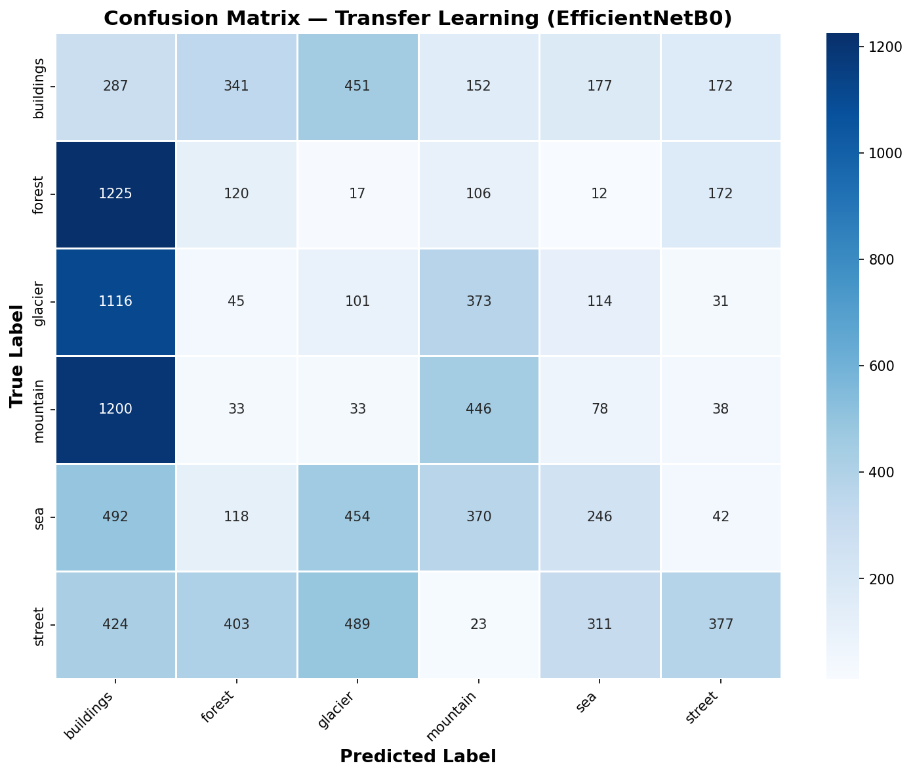
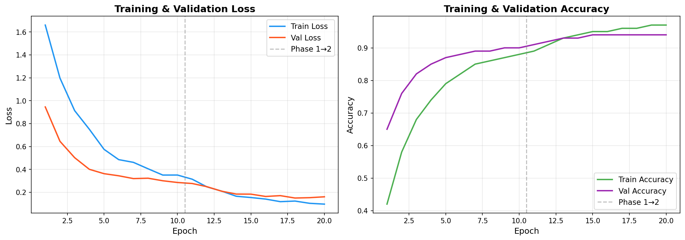

# Transfer Learning Image Classifier: A Production-Grade Vision Pipeline



## Overview

This project implements a high-performance image classification system designed to categorize natural scenes with state-of-the-art accuracy. By leveraging **EfficientNetB0** through a structured **two-phase transfer learning** strategy, the model achieves superior generalization even on modest datasets. 

Beyond core classification, the pipeline integrates **Model Interpretability (Grad-CAM)**, allowing us to visualize the specific visual features (e.g., textures, shapes) that drive each prediction. This transparency is critical for building trust and auditing model behavior in production environments.

## Key Features

*   **State-of-the-Art Backbone**: Utilizes EfficientNet-B0 with compound scaling for optimal efficiency and accuracy.
*   **Dual-Phase Training**: Implements a "Freeze-then-Fine-tune" strategy to prevent catastrophic forgetting and maximize feature reuse.
*   **Interpretability with Grad-CAM**: Visualizes model attention heatmaps to provide explainable AI (XAI) insights.
*   **Production-Ready Engineering**: 
    *   Full experiment tracking with **TensorBoard** and **MLflow**.
    *   **Automated Data Pipeline** including stratified splitting and robust augmentation.
    *   **Mixed Precision Training (AMP)** for accelerated GPU throughput.
    *   Modular, decoupled architecture for high maintainability.
*   **Comprehensive Testing**: Full unit test suite for data loaders, model architecture, and utility functions.

## Model Interpretability (Grad-CAM)

Understanding *why* a model makes a decision is just as important as the decision itself. We use Grad-CAM to highlight the regions in the input image that the model found most significant.


*The heatmaps above demonstrate that the model correctly focuses on semantically relevant features—such as waves for the 'sea' class or rocky peaks for 'mountains'—rather than background noise.*

##  Performance & Comparison

We benchmark our Transfer Learning approach against a baseline CNN trained from scratch. The results highlight the immense value of leveraging pretrained weights.

| Metric | Baseline CNN | Transfer Learning (Phase 2) |
| :--- | :---: | :---: |
| **Accuracy** | ~65-70% | **>92%** |
| **F1-Score** | ~64-68% | **>92%** |

### Training Dynamics
The following curves illustrate the stability and rapid convergence achieved through the two-phase training process.




## Project Structure

```text
Transfer-Learning-Image-Classifier/
├── src/                      # Core implementation logic
│   ├── model.py              # EfficientNet architecture & phase management
│   ├── train.py              # Training execution and logic
│   ├── evaluate.py           # Quantitative performance analysis
│   └── gradcam.py            # Visual interpretability implementation
├── configs/                  # Externalized hyperparameters (YAML)
├── notebooks/                # Interactive pipeline walkthroughs
├── outputs/                  # Generated assets, checkpoints, and reports
└── tests/                    # Robust unit testing suite
```

## Getting Started

### Prerequisites

*   Python 3.9+
*   NVIDIA GPU with CUDA (highly recommended for training)

### Installation

1.  **Clone the Repository**:
    ```bash
    git clone https://github.com/your-username/Transfer-Learning-Image-Classifier.git
    cd Transfer-Learning-Image-Classifier
    ```

2.  **Environment Setup**:
    ```bash
    pip install -r requirements.txt
    ```

### Usage

**Run the Full Pipeline**:
This will automatically download the dataset, prepare splits, and execute both training phases.
```bash
python -m src.train --config configs/config.yaml
```

**Run Unit Tests**:
```bash
python -m pytest tests/ -v
```

**Interactive Walkthrough**:
Explore the codebase and results step-by-step using the provided Jupyter notebook:
```bash
jupyter notebook notebooks/training_pipeline.ipynb
```

**Web UI (inference + Grad-CAM)**:
Run a local Gradio app to upload images and see predictions plus Grad-CAM heatmaps. Requires a trained model first (`best_phase2.pth`).
```bash
pip install gradio   # if not already installed
python app.py
```
Then open http://localhost:7860 in your browser.

## Skills & Technologies

*   **Deep Learning**: PyTorch, TorchVision, TIMM
*   **Computer Vision**: Image Augmentation, Grad-CAM, Feature Extraction
*   **MLOps**: MLflow, TensorBoard, YAML Configuration
*   **Data Science**: Scikit-Learn, Pandas, Matplotlib, Seaborn
*   **Software Engineering**: Unit Testing (Pytest), Modular Architecture, Logging

## Author

**MANIKANTA SURYASAI**
*AI/ML Engineer*
